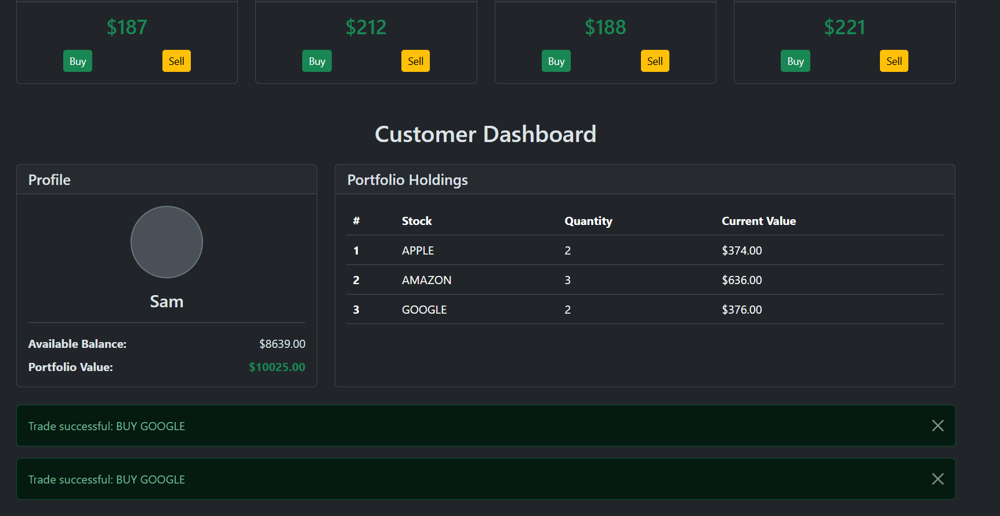

# Customer Portfolio Management System

This project is a demonstration of a microservices-based system for managing customer stock portfolios. It includes services for customer data, portfolio management, and an aggregator service that provides a unified API and a simple web interface.

## Project Structure

The project consists of the following main components:

*   **`aggregator-service`**:
    *   Acts as the primary entry point for the system.
    *   Provides a REST API for customer information and trading operations.
    *   Orchestrates calls to the `customer-service` and the simulated `stock-service`.
    *   Includes a simple HTML/JavaScript frontend ([`aggregator-service/src/main/resources/static/index.html`](c:\Users\zagor\Documents\GitHub\customerportfolio\aggregator-service\aggregator-service\src\main\resources\static\index.html)) for interacting with the system.
    *   Communicates with other services using reactive WebClient.
*   **`customer-service`**:
    *   Manages customer data (ID, name, balance).
    *   Manages customer stock holdings (portfolio items).
    *   Provides a REST API for CRUD operations on customers and their portfolios, and for processing trades.
    *   Uses a reactive Spring Data repository for data persistence (details of the database are not specified but typically H2 for development).
*   **`external-services.jar` (Simulated Stock Service)**:
    *   This JAR file simulates an external stock service.
    *   The `aggregator-service`'s `StockServiceClient` ([`aggregator-service/src/main/java/com/ozgur/aggregator/client/StockServiceClient.java`](c:\Users\zagor\Documents\GitHub\customerportfolio\aggregator-service\aggregator-service\src\main\java\com\ozgur\aggregator\client\StockServiceClient.java)) is configured to communicate with this simulated service to fetch stock prices and price streams.

## Key Technologies

*   Java
*   Spring Boot (WebFlux for reactive programming)
*   REST APIs
*   Project Reactor (Mono, Flux)
*   MockServer (for integration testing in `aggregator-service`)
*   HTML, JavaScript, Bootstrap (for the simple frontend)

## Getting Started

### Prerequisites

*   Java Development Kit (JDK) installed (version compatible with the project, likely 17+ based on modern Spring Boot usage)
*   Maven (for building the projects)

### Running the Application

1.  **Start the Simulated Stock Service (`external-services.jar`)**:
    Open a terminal and run the JAR file. The command will depend on how the JAR is packaged and if it requires specific ports. Typically, it might be:
    ```shell
    java -jar path/to/your/external-services.jar
    ```
    Ensure it's running on the host and port expected by the `aggregator-service` (check `aggregator-service/src/main/resources/application.properties` or `ServiceClientsConfig.java` for `stock.service.url`).

2.  **Run the `customer-service`**:
    Navigate to the `customer-service` directory:
    ```shell
    cd customer-service
    ```
    Run the Spring Boot application using Maven:
    ```shell
    mvn spring-boot:run
    ```
    This service will typically start on port 8080 (unless configured otherwise).

3.  **Run the `aggregator-service`**:
    Navigate to the `aggregator-service/aggregator-service` directory:
    ```shell
    cd aggregator-service/aggregator-service
    ```
    Run the Spring Boot application using Maven:
    ```shell
    mvn spring-boot:run
    ```
    This service will typically start on a different port (e.g., 8081, check its `application.properties`) to avoid conflict with the `customer-service`. The `customer.service.url` and `stock.service.url` in its configuration should point to the correct addresses of the `customer-service` and the `external-services.jar` respectively.

4.  **Access the Application**:
    Once all services are running, you can access the web interface provided by the `aggregator-service`. Open your browser and navigate to:
    `http://localhost:<aggregator-service-port>/?customer=1` (or another customer ID).
    For example, if the aggregator service runs on port 9000: `http://localhost:9000/?customer=1`

## API Endpoints

### Aggregator Service ([`CustomerPortfolioController.java`](c:\Users\zagor\Documents\GitHub\customerportfolio\aggregator-service\aggregator-service\src\main\java\com\ozgur\aggregator\controller\CustomerPortfolioController.java), [`StockPriceStreamController.java`](c:\Users\zagor\Documents\GitHub\customerportfolio\aggregator-service\aggregator-service\src\main\java\com\ozgur\aggregator\controller\StockPriceStreamController.java))

*   `GET /customers/{customerId}`: Get customer information and portfolio.
*   `POST /customers/{customerId}/trade`: Execute a trade (buy/sell) for a customer.
    *   Request Body: [`TradeRequest.java`](c:\Users\zagor\Documents\GitHub\customerportfolio\aggregator-service\aggregator-service\src\main\java\com\ozgur\aggregator\dto\TradeRequest.java) (`{ "ticker": "GOOGLE", "action": "BUY", "quantity": 1 }`)
*   `GET /stock/price-stream`: Stream real-time stock price updates (Server-Sent Events).

### Customer Service ([`CustomerController.java`](c:\Users\zagor\Documents\GitHub\customerportfolio\customer-service\src\main\java\com\ozgur\customerportfolio\controller\CustomerController.java))

*   `GET /customers/{customerId}`: Get customer information and holdings.
*   `POST /customers/{customerId}/trade`: Process a stock trade for a customer.
    *   Request Body: [`StockTradeRequest.java`](c:\Users\zagor\Documents\GitHub\customerportfolio\customer-service\src\main\java\com\ozgur\customerportfolio\dto\StockTradeRequest.java)

## Notes

*   The `aggregator-service` uses MockServer for its integration tests ([`AbstractIntegrationTest.java`](c:\Users\zagor\Documents\GitHub\customerportfolio\aggregator-service\aggregator-service\src\test\java\com\ozgur\aggregator\AbstractIntegrationTest.java)) to mock responses from the `customer-service` and `stock-service`.
*   The `external-services.jar` simulates the `stock-service`. The `StockServiceClient` in the `aggregator-service` is configured to point to the URL where this JAR exposes its endpoints.

---

